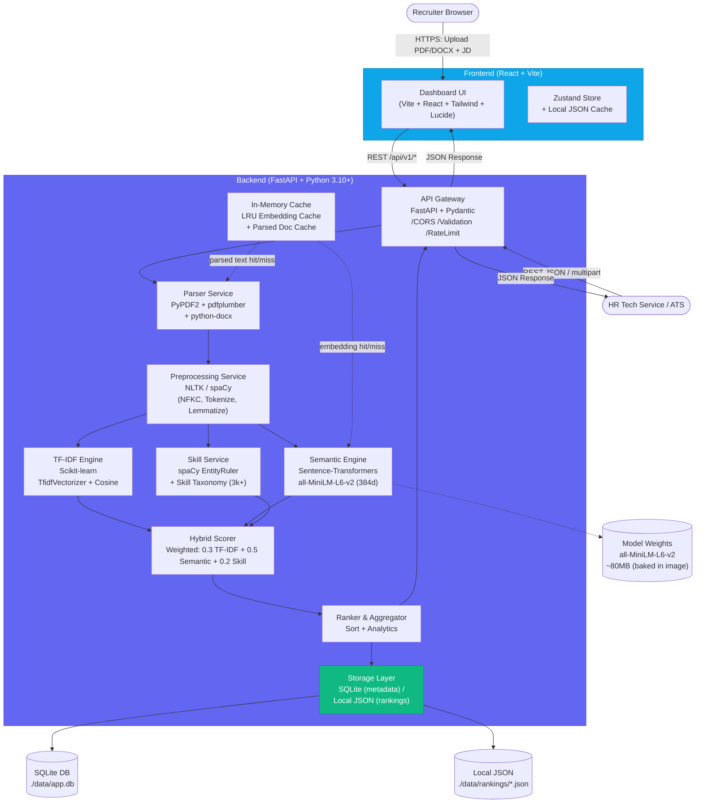
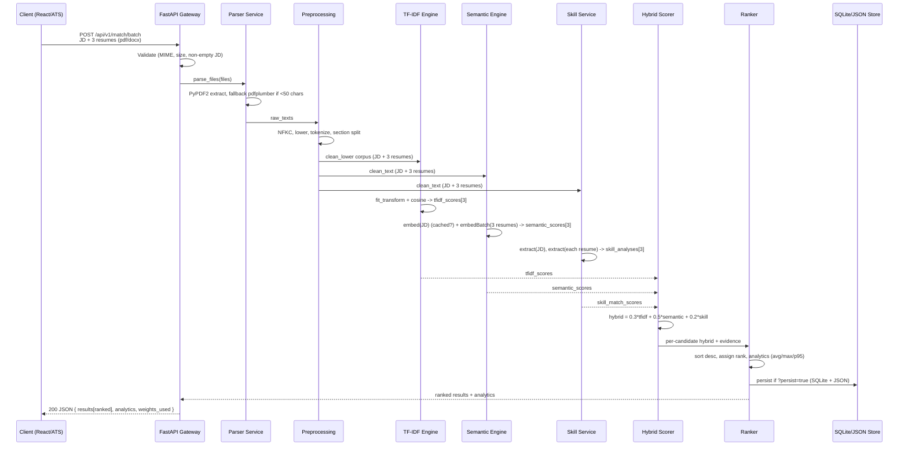

# ARCHITECTURE: AI Resume Screening & Job Matching System

**Version:** 1.0.0  
**Date:** 2026-09-13  
**Based on:** `PRD.md v1.0.0`  
**Status:** Draft / Ready for Implementation  
**Author:** Solutions Architect

---

## Table of Contents

1. [Overview & Principles](#1-overview--principles)
2. [High-Level Architecture Diagram](#2-high-level-architecture-diagram)
3. [Tech Stack](#3-tech-stack)
4. [Folder Structure (Monorepo)](#4-folder-structure-monorepo)
5. [Data Flow Pipeline](#5-data-flow-pipeline)
6. [Component Design](#6-component-design)
7. [Database / In-Memory Schema Definitions](#7-database--in-memory-schema-definitions)
8. [API Layer & Contracts](#8-api-layer--contracts)
9. [Frontend Architecture](#9-frontend-architecture)
10. [Cross-Cutting Concerns](#10-cross-cutting-concerns)
11. [Deployment & Scalability](#11-deployment--scalability)
12. [Traceability to PRD](#12-traceability-to-prd)

---

## 1. Overview & Principles

This document translates `PRD.md` into an implementable architecture for an AI Resume Screening & Job Matching System that satisfies the <2s p95 per-resume SLO (PRD §7) while remaining offline-capable and self-hostable.

**Architectural Principles:**

*   **API-First, Modular Monolith:** Single FastAPI process with clearly bounded services (`parser`, `preprocessing`, `scorer`, `skill`) for simplicity V1; extractable to microservices V2 without API breakage.
*   **Dual-Engine Hybrid Scoring:** Lexical (TF-IDF) + Semantic (`all-MiniLM-L6-v2` 384-dim) + Skill Gap are independent, composable, and weighted at request time.
*   **Stateless & Cache-Aware:** Stateless request handling; LRU in-memory caches for embeddings and parsed docs; ephemeral storage by default, optional SQLite persistence.
*   **Pluggable & Offline-Capable:** Model baked into Docker image; tokenizer/weights loaded locally; parser and extractor behind interfaces for future swap (e.g., `pdfplumber` -> `PyMuPDF`).
*   **Explainability by Design:** Every score returns evidence (top keywords, matched/missing skills, raw vs. semantic breakdown).

---

## 2. High-Level Architecture Diagram

### 2.1 Mermaid.js — System Context & Container View



### 2.2 ASCII — Request Lifecycle (Single Resume)

```
                +-------------------+
                |   Client (React)  |
                |  or ATS Service   |
                +---------+---------+
                          |
                          | POST /api/v1/match (multipart: JD + resume.pdf)
                          v
                +---------+---------+
                | FastAPI Gateway   |  <--- Pydantic Validation, MIME check (5MB limit),
                |  (gateway.py)     |       Rate limit, CORS
                +---------+---------+
                          |
              +-----------+-----------+
              |                       |
              v                       v
     +----------------+      +-----------------+
     | Parser Service |      |  Preprocessing  |
     |  - PyPDF2      |----->|  - NFKC norm    |
     |  - pdfplumber  |      |  - lower/strip  |
     |  - python-docx |      |  - NLTK/spaCy   |
     +-------+--------+      +--------+--------+
             |                        |
             v                        v
     +-------+--------+      +--------+--------+
     |  Raw Text +     |      |  Clean Text +  |
     |  Sections +     |<-----|  Tokens +      |
     |  Metadata       |      |  Sections      |
     +-------+--------+      +--------+--------+
             |                        |
             +-----------+------------+
                         |
                         v
          +--------------+--------------+
          |                              |
          v              v               v
   +------+------+ +-----+------+ +------+-------+
   |  TF-IDF     | | Semantic   | | Skill        |
   |  Scikit-    | | all-MiniLM | | spaCy +      |
   |  learn      | | L6-v2      | | Taxonomy KB  |
   +------+------+ +-----+------+ +------+-------+
          |              |               |
          |              | LRU Cache     |
          |              +--[Emb Cache]--+
          v              v               v
   +------+--------------+---------------+------+
   |         Hybrid Scorer (weighted sum)      |
   |  hybrid = 0.3*tfidf + 0.5*semantic        |
   |           + 0.2*skill_match               |
   +----------------------+--------------------+
                          |
                          v
                +---------+---------+
                | Ranker + Analytics|
                | - sort by hybrid  |
                | - gap analysis    |
                +---------+---------+
                          |
                          v
                +---------+---------+
                | Storage Layer     |
                | - SQLite (meta)   |
                | - JSON (rankings) |
                +---------+---------+
                          |
                          v
                +---------+---------+
                | JSON API Output   | ---> Dashboard Table + Detail Drawer
                +-------------------+
```

### 2.3 Component Interaction — Batch (50 resumes)

```
JD + 50 resumes --> Gateway validates --> Parser (parallel, ThreadPoolExecutor)
                                        |
                                        v
                                  Preprocessing (batched)
                                        |
                    +-------------------+-------------------+
                    |                   |                   |
              TF-IDF fit on         Semantic encode     Skill extract
              JD+batch (1 fit)      JD 1x + 50x batched JD + 50x
                    |                (batch=32)             |
                    v                   v                   v
                 Hybrid Scorer per candidate (vectorized)
                    |
                    v
                 Ranker sorts N=50, computes analytics (avg/max/p95)
                    |
                    v
                 Persist to JSON + SQLite (optional), return ranked JSON
```

---

## 3. Tech Stack

### 3.1 Backend — Python 3.10+

| Layer | Technology | Version | Purpose | Justification vs PRD |
| :--- | :--- | :--- | :--- | :--- |
| **Runtime** | Python | 3.10+ | Language | PRD §16.1 requirement; stable typing |
| **Web Framework** | FastAPI | `>=0.110.0` | API gateway, auto OpenAPI | High performance (ASGI), Pydantic-native validation |
| **Validation** | Pydantic | `v2` | Request/response schemas | Type-safe contracts, aligns with FastAPI |
| **Server** | Uvicorn | `>=0.29.0` | ASGI server | Production-grade, reload for dev |
| **PDF Parsing** | PyPDF2 | `>=3.0.0` | Primary text extraction | Per prompt spec; fallback lightweight |
| **PDF Parsing** | pdfplumber | `>=0.10.0` | Layout-aware fallback | Better for 2-column/table PDFs vs PyPDF2 alone |
| **DOCX Parsing** | python-docx | `>=1.1.0` | DOCX paragraph/table extraction | Standard for DOCX |
| **Config** | python-multipart, pydantic-settings | latest | File upload & env config | Required for multipart/form-data |

**Backend Alternatives Considered:** `PyMuPDF` was PRD-proposed but prompt constrains to `PyPDF2/pdfplumber`; architecture keeps `ParserInterface` so `PyMuPDF` can be reintroduced without API change.

### 3.2 ML / NLP

| Component | Technology | Version | Purpose |
| :--- | :--- | :--- | :--- |
| **TF-IDF** | Scikit-learn | `>=1.3.0` | `TfidfVectorizer(ngram_range=(1,2), max_features=5000, sublinear_tf=True)` + `cosine_similarity` |
| **Embeddings** | Sentence-Transformers | `>=2.2.2` | `all-MiniLM-L6-v2` (80MB, 384-dim, 256 tokens max) |
| **Tensor Backend** | PyTorch (CPU) | `>=2.2.0+cpu` | Embedding inference, `torch.no_grad()` |
| **NLP Toolkit** | spaCy | `>=3.7.0` + `en_core_web_sm` | Sentence segmentation, lemmatization, EntityRuler |
| **NLP Alternative** | NLTK | `>=3.8` | Tokenization, stopwords fallback if spaCy not available |
| **Skill Taxonomy** | Custom JSON + RapidFuzz* | `taxonomy.json` (~3k skills) | Dictionary matching; fuzzy threshold 85. *RapidFuzz optional if installed, else exact match fallback |
| **Preprocessing** | `unicodedata`, `regex` | stdlib | NFKC, whitespace collapse |

**Model Rationale (PRD §4.3):** `all-MiniLM-L6-v2` chosen for 5x speed vs `mpnet-base`, fits 10k embeddings in RAM, strong STS performance; LRU cache + mean-pool chunking for >256 token docs.

### 3.3 Frontend — React

| Layer | Technology | Version | Purpose |
| :--- | :--- | :--- | :--- |
| **Build Tool** | Vite | `>=5.0` | Dev server & bundler (fast HMR) |
| **Framework** | React | `18.2+` | Component model, hooks |
| **Language** | TypeScript | `5.3+` | Type safety |
| **Styling** | Tailwind CSS | `3.4+` | Utility-first, design system |
| **Icons** | Lucide React | `>=0.344.0` | `lucide-react` — consistent, tree-shakable SVGs (prompt spec) |
| **State** | Zustand | `>=4.5` | Lightweight global store (JD, weights, results) |
| **HTTP** | Axios / fetch | latest | API client |
| **Data Grid** | TanStack Table (opt) or native table | `8.x` | Sorting, filtering, pagination |
| **Charts** | Recharts | `2.12+` | Histogram, bar chart for score breakdown |
| **Routing** | React Router | `6.22+` | SPA routing (future multi-page) |

**Why React + Vite + Tailwind + Lucide:** Prompt-constrained; Vite provides <300ms HMR, Tailwind ensures consistent design tokens, Lucide satisfies iconography without heavy bundles.

### 3.4 Storage / State

| Store | Technology | Purpose | Durability |
| :--- | :--- | :--- | :--- |
| **Primary (V1 Ephemeral)** | In-Memory `dict` + `functools.lru_cache` | Embedding cache (1000 entries), parsed doc cache | Process-local, cleared on restart |
| **Secondary (V1 Persistent Opt-in)** | Local JSON | `./data/rankings/{job_id}.json` — full ranking output | File system, gitignored |
| **Metadata Store** | SQLite | `./data/app.db` — `jobs`, `candidates`, `rankings` tables (see §7) | File DB, WAL mode, no external service |
| **Frontend State** | Zustand + `localStorage` | JD text, weights, last ranking JSON | Browser-local |
| **Future (V1.1)** | PostgreSQL | Migration path from SQLite via SQLAlchemy | Docker Compose profile |

**Why Local JSON + SQLite:** Prompt spec; SQLite covers structured queries (e.g., "show last 10 jobs") while JSON gives zero-migration, human-inspectable dumps; both are offline, zero-ops, <2s latency compatible (no network hop).

### 3.5 Dev & Infra

| Tool | Purpose |
| :--- | :--- |
| Docker + Docker Compose | Backend image (model baked), frontend image, SQLite volume |
| Pytest + pytest-benchmark | Unit + latency benchmarks (p95 <2s assertion) |
| Ruff + Black + MyPy | Lint/format/type-check |
| GitHub Actions (future) | CI: lint → test → build |

---

## 4. Folder Structure (Monorepo)

Prompt requires `/backend` and `/frontend` monorepo layout. Structure below is scaffold-ready and maps 1:1 to PRD components (PRD §14 M0-M4).

```
ai-resume-screening/               # repo root
├── PRD.md                         # already present (commit 41275b6)
├── ARCHITECTURE.md                # this file
├── README.md                      # quickstart, API examples
├── .gitignore                     # Python, Node, data/, .env
├── docker-compose.yml             # backend + frontend + volumes
├── .env.example
│
├── backend/                       # Python 3.10+ | FastAPI
│   ├── Dockerfile                 # model baked, torch CPU
│   ├── requirements.txt           # pinned deps
│   ├── pyproject.toml             # ruff, black, mypy, pytest
│   ├── app/
│   │   ├── __init__.py
│   │   ├── main.py                # FastAPI app factory, lifespan (load model), CORS
│   │   ├── config.py              # pydantic-settings (MODEL_NAME, MAX_FILE_MB, CACHE_SIZE)
│   │   ├── api/
│   │   │   ├── __init__.py
│   │   │   ├── v1/
│   │   │   │   ├── __init__.py
│   │   │   │   ├── health.py      # GET /health
│   │   │   │   ├── parse.py       # POST /parse
│   │   │   │   ├── skills.py      # POST /extract-skills, GET /taxonomy
│   │   │   │   ├── match.py       # POST /match, POST /match/batch, POST /rank
│   │   │   │   └── router.py      # Aggregates v1 routers
│   │   │   └── deps.py            # Dependency injection (get_model, get_taxonomy)
│   │   ├── models/
│   │   │   ├── __init__.py
│   │   │   ├── schemas.py         # Pydantic: MatchRequest, BatchRequest, ScoreResponse
│   │   │   └── domain.py          # Dataclasses: ResumeDoc, SkillAnalysis, ScoringResult
│   │   ├── services/
│   │   │   ├── __init__.py
│   │   │   ├── parser_service.py  # ParserInterface -> PyPDF2Parser, PdfPlumberParser, DocxParser
│   │   │   ├── preprocessing.py   # TextNormalizer (NFKC, clean, section split, tokenize)
│   │   │   ├── tfidf_service.py   # TFIDFScorer (fit, transform, cosine)
│   │   │   ├── embedding_service.py # STEmbedder (load all-MiniLM-L6-v2, chunk, LRU)
│   │   │   ├── skill_service.py   # SkillExtractor (taxonomy + spaCy EntityRuler)
│   │   │   ├── hybrid_scorer.py   # HybridScorer (weights 0.3/0.5/0.2, hybrid calc)
│   │   │   └── ranker.py          # Ranker (sort, analytics, gap analysis)
│   │   ├── core/
│   │   │   ├── __init__.py
│   │   │   ├── cache.py           # LRU in-memory (embedding + parsed)
│   │   │   ├── errors.py          # AppError, error codes
│   │   │   └── logging.py         # structured logging
│   │   ├── storage/
│   │   │   ├── __init__.py
│   │   │   ├── sqlite_store.py    # SQLAlchemy/SQLite (jobs, candidates, rankings)
│   │   │   ├── json_store.py      # Local JSON read/write (data/rankings/)
│   │   │   └── repository.py      # Repository facade (sqlite + json)
│   │   └── data/
│   │       ├── taxonomy.json      # 3k+ canonical skills + aliases {"k8s": "kubernetes"}
│   │       └── __init__.py
│   ├── data/                      # gitignored at root, mounted volume
│   │   ├── app.db                 # SQLite (WAL)
│   │   └── rankings/              # JSON dumps
│   └── tests/
│       ├── __init__.py
│       ├── conftest.py
│       ├── test_parser.py
│       ├── test_preprocessing.py
│       ├── test_tfidf.py
│       ├── test_embeddings.py
│       ├── test_skills.py
│       ├── test_hybrid.py
│       ├── test_api.py
│       └── benchmark_latency.py   # p95 <2s assertion
│
├── frontend/                      # React + Vite
│   ├── Dockerfile
│   ├── index.html
│   ├── vite.config.ts             # proxy /api -> backend:8000
│   ├── tailwind.config.js
│   ├── postcss.config.js
│   ├── package.json
│   ├── tsconfig.json
│   ├── public/
│   │   └── favicon.svg
│   └── src/
│       ├── main.tsx               # ReactDOM.createRoot
│       ├── App.tsx                # Layout + Router
│       ├── api/
│       │   ├── client.ts          # Axios instance, baseURL, interceptors
│       │   └── types.ts           # Mirrors backend schemas
│       ├── store/
│       │   └── useRankingStore.ts # Zustand (jd, weights, results, history)
│       ├── components/
│       │   ├── ui/                # Button, Card, Badge, Slider (Tailwind + Lucide)
│       │   ├── UploadZone.tsx     # Drag-drop JD + resumes (pdf/docx)
│       │   ├── WeightSliders.tsx  # TF-IDF/Semantic/Skill sliders (sum=1)
│       │   ├── RankingTable.tsx   # Sortable, paginated, color-coded >80/>60
│       │   ├── DetailDrawer.tsx   # Bar chart + chips + text toggle
│       │   ├── AnalyticsBar.tsx   # Avg/max/p95 + histogram (Recharts)
│       │   └── Header.tsx
│       ├── pages/
│       │   ├── Dashboard.tsx      # composes UploadZone + AnalyticsBar + RankingTable
│       │   └── History.tsx        # past rankings from JSON/SQLite (optional)
│       ├── hooks/
│       │   └── useMatch.ts        # POST /match/batch hook
│       ├── lib/
│       │   └── utils.ts           # cn(), formatters
│       └── styles/
│           └── index.css          # Tailwind directives
│
└── scripts/
    ├── download_model.py          # pre-fetch all-MiniLM-L6-v2 for Docker bake
    └── seed_taxonomy.py           # generate taxonomy.json
```

**Key Design Notes:**

*   `ParserInterface` abstraction allows `PyPDF2`/`pdfplumber` to be swapped or chained (primary `PyPDF2`, fallback `pdfplumber` on low confidence <50 chars, per PRD §4.1).
*   `storage/repository.py` hides SQLite vs JSON choice from services; `persist` query param controls write-through.
*   `frontend` proxies `/api` to backend in dev via Vite `server.proxy`, avoiding CORS in production via same-origin nginx or compose networking.

---

## 5. Data Flow Pipeline

Pipeline implements PRD §5 + §4.1–4.5 as a linear, observable chain. Each stage is pure-functional where possible and emits structured logs.

### 5.1 Pipeline Stages — Overview

```
Document Ingestion  ->  Preprocessing  ->  Hybrid Scoring (TF-IDF + Embeddings)
        |                      |                              |
        v                      v                              v
   Skill Matching  ->  Ranking & Aggregation  ->  JSON API Output
```

### 5.2 Stage Details

#### Stage 1: Document Ingestion

*   **Input:** `multipart/form-data` with `job_description: str` (required) + `resume_files: File[]` (1–100, each 5MB max, MIME `application/pdf` / `application/vnd.openxmlformats-officedocument.wordprocessingml.document`) OR JSON `resume_text`.
*   **Validation (Gateway):** Pydantic checks non-empty JD, at least one resume, file magic bytes (`%PDF` for PDF, `PK\x03\x04` for DOCX ZIP), size limits; returns `400/413/422` per PRD §9.10.
*   **Parser Dispatch:**
    ```python
    def parse_file(file: UploadFile) -> ParsedDoc:
        if file.content_type == "application/pdf":
            text = PyPDF2Extractor.extract(file)  # PdfReader, concat pages
            if len(text.strip()) < 50:            # low confidence fallback
                text = PdfPlumberExtractor.extract(file)  # layout-aware
        elif file.content_type.endswith("wordprocessingml.document"):
            text = DocxExtractor.extract(file)    # python-docx paragraphs+tables
    ```
*   **Output:** `ParsedDoc { filename, raw_text, pages, char_count, extraction_confidence, raw_text_hash }` — cached by hash in `parsed_cache`.

#### Stage 2: Preprocessing

*   **Owner:** `services/preprocessing.py` (`TextNormalizer`)
*   **Steps (per doc, ~10–30ms):**
    1.  `NFKC` Unicode normalize (`unicodedata.normalize`)
    2.  Strip emails/phones if `privacy_mode=true` (regex)
    3.  Lowercase (for TF-IDF path), preserve case for NER path (dual output)
    4.  Remove non-ASCII noise, collapse whitespace, remove headers/footers
    5.  Section split: regex `(Skills|Experience|Education|Projects)\s*[:\-]?\n` with fallback to full text if no headers
    6.  Tokenization & lemmatization: `spaCy` (`en_core_web_sm`) or `nltk.word_tokenize` fallback; stopword removal ONLY for TF-IDF
*   **Output:** `CleanDoc { clean_text, clean_lower, sections: {skills, experience, education}, tokens, sentences }`

#### Stage 3: Hybrid Scoring (TF-IDF + Embeddings)

*   **Parallel sub-stages (3a–3c) execute concurrently where possible:**

    **3a. TF-IDF Branch (~20–50ms):**
    ```python
    vectorizer = TfidfVectorizer(
        ngram_range=(1,2), max_features=5000,
        sublinear_tf=True, stop_words='english'
    )
    corpus = [jd_clean_lower] + [r.clean_lower for r in resumes_clean]
    tfidf_matrix = vectorizer.fit_transform(corpus)
    scores = cosine_similarity(tfidf_matrix[0:1], tfidf_matrix[1:]).flatten() * 100
    top_keywords = explain_tfidf(vectorizer, tfidf_matrix, top_k=15)
    ```

    **3b. Semantic Branch (~150–300ms warm, batch):**
    ```python
    # Model loaded once at startup (lifespan), cached
    model = SentenceTransformer("sentence-transformers/all-MiniLM-L6-v2")  # 384d

    def embed(text: str) -> np.ndarray:
        if hash(text) in lru_cache: return lru_cache[hash(text)]
        # chunk to 256 tokens max: sentence-split, encode chunks, mean-pool, L2 norm
        chunks = chunk_by_sentences(text, max_tokens=256)
        embs = model.encode(chunks, batch_size=32, normalize_embeddings=True, show_progress_bar=False)
        pooled = np.mean(embs, axis=0); pooled /= np.linalg.norm(pooled)
        lru_cache[hash(text)] = pooled
        return pooled

    jd_emb = embed(jd_clean)
    resume_embs = [embed(r.clean_text) for r in resumes]  # batched
    semantic_scores = [cosine(jd_emb, r_emb)*100 for r_emb in resume_embs]
    # cosine in [-1,1] -> clipped to [0,100]; model uses normalized embeddings so dot==cosine
    ```

    **3c. Skill Signal preparation (for hybrid):** Extracted in Stage 4 but scored here as `skill_match_score ∈ [0,100]`.

    **Hybrid Formula (configurable):**
    ```python
    hybrid = w_tfidf * tfidf_score + w_semantic * semantic_score + w_skill * skill_match_score
    # defaults 0.3 / 0.5 / 0.2, validated sum==1.0 (auto-normalize if not)
    ```

#### Stage 4: Skill Matching

*   **Owner:** `services/skill_service.py`
*   **Taxonomy Load:** `data/taxonomy.json` — canonical skills + aliases. Example:
    ```json
    { "canonical": "kubernetes", "aliases": ["k8s", "kube"], "category": "DevOps" }
    ```
*   **Extraction:**
    1.  Normalize text: lower, lemmatize.
    2.  Dictionary match: exact + fuzzy (RapidFuzz threshold 85 if installed, else exact only).
    3.  spaCy EntityRuler override: patterns for multi-word skills ("machine learning", "ci/cd").
    4.  Dedupe & alias-resolve to canonical.
*   **Gap Analysis (set ops):**
    ```python
    jd_skills = extract(jd_clean)
    resume_skills = extract(resume_clean)
    matched = jd_skills ∩ resume_skills
    missing = jd_skills - resume_skills
    extra   = resume_skills - jd_skills
    skill_match_score = len(matched)/len(jd_skills)*100 if jd_skills else 0
    ```

#### Stage 5: Ranking & Aggregation

*   **Ranker:** Sort candidates descending by `hybrid_score`, assign `rank=1..N`, compute analytics (`avg`, `max`, `min`, `p95_latency_ms`).
*   **Detail Enrichment:** Attach per-candidate `top_matched_keywords`, `skill_analysis`, `latency_ms`.

#### Stage 6: JSON API Output & Persistence

*   **Response:** Structured JSON per PRD §9.6–9.7 (scores 0–100, skill_analysis, analytics).
*   **Persistence (opt-in):** If `?persist=true`, write to `SQLite` (`jobs` + `candidates` + `rankings`) and dump full JSON to `data/rankings/{job_id}.json`. Frontend `History` page reads these.
*   **Frontend Render:** `AnalyticsBar` (avg/max/histogram), `RankingTable` (sortable, color-coded, chips for missing skills), `DetailDrawer` (bar chart + Venn).

### 5.3 Latency Budget (per resume, PRD SLO <2s p95)

| Stage | Budget | Notes |
| :--- | :--- | :--- |
| Ingestion + Parse | 80–200ms | PyPDF2 fast; pdfplumber fallback adds 100ms |
| Preprocessing | 10–30ms | spaCy pipeline minimal (no parser/NER) |
| TF-IDF | 20–50ms | Fit on batch once, not per resume |
| Semantic (warm) | 150–300ms | Batched, LRU hit ~5ms |
| Skill Extraction | 20–60ms | Dictionary + ruler |
| Hybrid + Rank | <5ms | Arithmetic |
| **Total p50** | **~400–700ms** | Well under 1s p50 SLO |
| **Total p95** | **~900–1400ms** | Meets <2s p95; batch 50 → <45s total |

### 5.4 Sequence Diagram (Mermaid) — Batch Match



---

## 6. Component Design

### 6.1 Parser Service — Interface

```python
# backend/app/services/parser_service.py
from abc import ABC, abstractmethod
from dataclasses import dataclass

@dataclass
class ParsedDoc:
    filename: str
    raw_text: str
    pages: int
    char_count: int
    extraction_confidence: float  # len(raw_text)/expected heuristic
    sha256: str

class ParserInterface(ABC):
    @abstractmethod
    def extract(self, file_bytes: bytes, filename: str) -> ParsedDoc: ...

class PyPDF2Parser(ParserInterface): ...
class PdfPlumberParser(ParserInterface): ...
class DocxParser(ParserInterface): ...

class ParserService:
    def parse(self, file: UploadFile) -> ParsedDoc:
        # MIME dispatch + fallback chain
        ...
```

### 6.2 Model Lifespan & Caching

```python
# backend/app/main.py
from contextlib import asynccontextmanager
from sentence_transformers import SentenceTransformer

@asynccontextmanager
async def lifespan(app: FastAPI):
    # Load model once; bake weights in Docker to avoid download at runtime
    app.state.st_model = SentenceTransformer("sentence-transformers/all-MiniLM-L6-v2")
    app.state.tfidf_cache = LRUCache(maxsize=1000)
    app.state.embedding_cache = LRUCache(maxsize=1000)
    yield
    app.state.embedding_cache.clear()

app = FastAPI(lifespan=lifespan)
```

*   `torch.no_grad()` and `normalize_embeddings=True` enforced.
*   If model load fails (offline without baked weights), `/health` reports `model_loaded: false` and scorer falls back to TF-IDF-only with warning header.

---

## 7. Database / In-Memory Schema Definitions

### 7.1 In-Memory Pydantic Schemas (API Contracts)

Mirrored in `frontend/src/api/types.ts` for end-to-end typing.

```python
# backend/app/models/schemas.py
from pydantic import BaseModel, Field, field_validator
from typing import List, Optional, Dict
from enum import Enum

class Weights(BaseModel):
    tfidf: float = Field(default=0.3, ge=0, le=1)
    semantic: float = Field(default=0.5, ge=0, le=1)
    skill: float = Field(default=0.2, ge=0, le=1)

    @field_validator("*", mode="after")
    @classmethod
    def normalize(cls, v, info):
        return v  # normalization in service if sum !=1

class SkillAnalysis(BaseModel):
    jd_skills: List[str] = Field(default_factory=list)
    resume_skills: List[str] = Field(default_factory=list)
    matched_skills: List[str] = Field(default_factory=list)
    missing_skills: List[str] = Field(default_factory=list)
    extra_skills: List[str] = Field(default_factory=list)
    skill_match_score: float = Field(ge=0, le=100)

class Scores(BaseModel):
    tfidf_score: float = Field(ge=0, le=100)
    semantic_score: float = Field(ge=0, le=100)
    skill_match_score: float = Field(ge=0, le=100)
    hybrid_score: float = Field(ge=0, le=100)

class MatchedKeyword(BaseModel):
    term: str
    score: float

class CandidateResult(BaseModel):
    rank: int
    candidate_id: Optional[str] = None
    filename: Optional[str] = None
    scores: Scores
    skill_analysis: SkillAnalysis
    details: Dict  # top_matched_keywords, hybrid_weights
    latency_ms: int
    status: str = "SUCCESS"  # or "FAILED"

class BatchMatchRequest(BaseModel):
    job_description: str = Field(min_length=1)
    resumes: Optional[List[Dict]] = None  # for JSON mode
    weights: Weights = Field(default_factory=Weights)

class BatchMatchResponse(BaseModel):
    job_description_preview: str
    weights_used: Weights
    total_processed: int
    total_failed: int
    results: List[CandidateResult]
    analytics: Dict  # avg/max/min/p95

class ParseResponse(BaseModel):
    filename: str
    raw_text: str
    clean_text: str
    sections: Dict[str, str]
    metadata: Dict
```

**Domain dataclasses** (`backend/app/models/domain.py`) mirror these but add `embedding: Optional[np.ndarray]` and `clean_text` variants for internal use.

### 7.2 SQLite Schema (Persistent Metadata & Rankings)

Uses SQLAlchemy ORM (sync) with WAL mode for concurrent reads.

```sql
-- data/app.db — init via backend/app/storage/sqlite_store.py

-- Jobs: one row per JD / ranking session
CREATE TABLE IF NOT EXISTS jobs (
    job_id          TEXT PRIMARY KEY,          -- uuid4
    title           TEXT,                      -- optional, parsed from JD first line
    description     TEXT NOT NULL,             -- full JD text
    description_hash TEXT NOT NULL,            -- sha256 for dedup/cache
    weights_json    TEXT NOT NULL,             -- '{"tfidf":0.3,"semantic":0.5,"skill":0.2}'
    created_at      TEXT NOT NULL DEFAULT (strftime('%Y-%m-%dT%H:%M:%fZ','now')),
    total_candidates INTEGER NOT NULL DEFAULT 0
);
CREATE INDEX idx_jobs_hash ON jobs(description_hash);
CREATE INDEX idx_jobs_created ON jobs(created_at);

-- Candidates: deduplicated by file hash or candidate_id
CREATE TABLE IF NOT EXISTS candidates (
    candidate_id    TEXT PRIMARY KEY,          -- provided or uuid4
    filename        TEXT,
    raw_text        TEXT,
    clean_text      TEXT,
    file_hash       TEXT UNIQUE,               -- sha256(raw_text)
    skills_json     TEXT,                      -- '["python","aws"]' (canonical)
    created_at      TEXT NOT NULL DEFAULT (strftime('%Y-%m-%dT%H:%M:%fZ','now'))
);
CREATE INDEX idx_candidates_hash ON candidates(file_hash);

-- Rankings: one row per candidate per job (many-to-many with scores)
CREATE TABLE IF NOT EXISTS rankings (
    ranking_id      TEXT PRIMARY KEY,          -- uuid4
    job_id          TEXT NOT NULL REFERENCES jobs(job_id) ON DELETE CASCADE,
    candidate_id    TEXT NOT NULL REFERENCES candidates(candidate_id) ON DELETE CASCADE,
    rank            INTEGER NOT NULL,
    tfidf_score     REAL NOT NULL CHECK (tfidf_score BETWEEN 0 AND 100),
    semantic_score  REAL NOT NULL CHECK (semantic_score BETWEEN 0 AND 100),
    skill_match_score REAL NOT NULL CHECK (skill_match_score BETWEEN 0 AND 100),
    hybrid_score    REAL NOT NULL CHECK (hybrid_score BETWEEN 0 AND 100),
    matched_skills_json TEXT,                  -- JSON array
    missing_skills_json TEXT,
    extra_skills_json   TEXT,
    top_keywords_json   TEXT,                  -- JSON array of {term,score}
    latency_ms      INTEGER NOT NULL,
    created_at      TEXT NOT NULL DEFAULT (strftime('%Y-%m-%dT%H:%M:%fZ','now')),
    UNIQUE(job_id, candidate_id)
);
CREATE INDEX idx_rankings_job_hybrid ON rankings(job_id, hybrid_score DESC);
CREATE INDEX idx_rankings_candidate ON rankings(candidate_id);

-- Analytics snapshot (optional, for dashboard history without recompute)
CREATE TABLE IF NOT EXISTS analytics (
    analytics_id    TEXT PRIMARY KEY,
    job_id          TEXT NOT NULL REFERENCES jobs(job_id) ON DELETE CASCADE,
    avg_hybrid      REAL NOT NULL,
    max_hybrid      REAL NOT NULL,
    min_hybrid      REAL NOT NULL,
    p95_latency_ms  INTEGER NOT NULL,
    histogram_json  TEXT,                      -- bucketed hybrid distribution
    created_at      TEXT NOT NULL DEFAULT (strftime('%Y-%m-%dT%H:%M:%fZ','now'))
);
```

**SQLite Pragmas (on connect):**

```python
conn.execute("PRAGMA journal_mode=WAL;")
conn.execute("PRAGMA synchronous=NORMAL;")
conn.execute("PRAGMA foreign_keys=ON;")
```

### 7.3 Local JSON Schema (Ephemeral / Export)

Mirrors `BatchMatchResponse` exactly for zero-translation dumps.

```json
// data/rankings/{job_id}.json
{
  "job_id": "7f3a...",
  "job_description_preview": "We need a Python developer...",
  "job_description_hash": "a3f5...",
  "weights_used": { "tfidf": 0.3, "semantic": 0.5, "skill": 0.2 },
  "total_processed": 50,
  "total_failed": 0,
  "results": [
    {
      "rank": 1,
      "candidate_id": "cand_001",
      "filename": "alice.pdf",
      "scores": { "tfidf_score": 72.1, "semantic_score": 88.4, "skill_match_score": 75.0, "hybrid_score": 80.83 },
      "skill_analysis": {
        "jd_skills": ["python", "aws"],
        "resume_skills": ["python", "aws", "docker"],
        "matched_skills": ["python", "aws"],
        "missing_skills": [],
        "extra_skills": ["docker"],
        "skill_match_score": 100.0
      },
      "details": { "top_matched_keywords": [{ "term": "python", "score": 0.42 }], "hybrid_weights": { "tfidf": 0.3, "semantic": 0.5, "skill": 0.2 } },
      "latency_ms": 742
    }
  ],
  "analytics": { "avg_hybrid_score": 65.2, "max_hybrid_score": 80.8, "min_hybrid_score": 42.1, "p95_latency_ms": 890, "histogram": [5, 12, 20, 13] },
  "created_at": "2026-09-13T11:30:00Z",
  "model": "sentence-transformers/all-MiniLM-L6-v2",
  "version": "1.0.0"
}
```

**JSON Store Conventions:**

*   File naming: `data/rankings/{job_id}.json` + `data/rankings/latest.json` symlink/copy for frontend quick-load.
*   Retention: Not git-tracked; `data/` in `.gitignore`; pruning script keeps last 100 jobs.
*   Export: `GET /api/v1/rank?job_id=...&format=csv` streams CSV derived from JSON.

### 7.4 In-Memory Caches

```python
# backend/app/core/cache.py
from functools import lru_cache
from cachetools import LRUCache

embedding_cache: LRUCache[str, np.ndarray] = LRUCache(maxsize=1000)  # key: sha256(clean_text)
parsed_cache: LRUCache[str, ParsedDoc] = LRUCache(maxsize=500)       # key: sha256(file_bytes)

# Hit path: ~5ms (hash lookup + copy); miss path: full encode 150-300ms
# Eviction: LRU; thread-safe via RLock
```

### 7.5 Skill Taxonomy JSON

```json
// backend/app/data/taxonomy.json
{
  "version": "2026-09",
  "count": 3120,
  "skills": [
    { "canonical": "python", "aliases": ["py"], "category": "Language" },
    { "canonical": "kubernetes", "aliases": ["k8s", "kube"], "category": "DevOps" },
    { "canonical": "machine learning", "aliases": ["ml"], "category": "AI/ML" }
  ]
}
```

---

## 8. API Layer & Contracts

Full OpenAPI at `/docs` (Swagger) auto-generated from Pydantic schemas. Mirrors PRD §9 with prompt-constrained parser tech.

| Method | Path | Handler | Notes |
| :--- | :--- | :--- | :--- |
| `GET` | `/health` | `health.py` | Returns `model_loaded`, `version`, `uptime`; used by Docker HEALTHCHECK |
| `POST` | `/api/v1/parse` | `parse.py` | `multipart` file → `ParseResponse`; uses PyPDF2/pdfplumber fallback |
| `POST` | `/api/v1/extract-skills` | `skills.py` | JSON `{text}` → `{skills, count}` |
| `POST` | `/api/v1/match` | `match.py` | Single JD+resume (JSON or multipart) → `CandidateResult` |
| `POST` | `/api/v1/match/batch` | `match.py` | Batch JD+`resume_files[]` → `BatchMatchResponse` (ranked) |
| `POST` | `/api/v1/rank` | `match.py` | Alias to batch with `dashboard` histogram |
| `GET` | `/api/v1/skills/taxonomy` | `skills.py` | Returns taxonomy.json |

**Error Envelope (consistent):**
```json
{ "detail": "Invalid file type. Only PDF and DOCX allowed.", "code": "INVALID_FILE_TYPE", "status": 400 }
```

**Status Codes:** PRD §9.10 — `200/400/413/422/500/503` with `503` when model not ready.

---

## 9. Frontend Architecture

### 9.1 Component Tree

```
App.tsx
├── Header (Lucide: Brain, FileText)
├── Dashboard.tsx
│   ├── UploadZone (Lucide: Upload, File, Trash2)
│   │   ├── JD textarea + file drop
│   │   └── Resume multi-file drop (pdf/docx, 5MB check)
│   ├── WeightSliders (Sliders sum=1, auto-normalize)
│   ├── AnalyticsBar (Recharts histogram + avg/max/p95)
│   ├── RankingTable (TanStack Table)
│   │   └── Row: rank badge, hybrid (color), tfidf/semantic/skill, chips, View
│   └── DetailDrawer (Sheet)
│       ├── Score bar chart
│       ├── Skill Venn / chips (matched/missing/extra)
│       ├── Keyword evidence
│       └── Raw/Clean toggle
└── History.tsx (table of past jobs from SQLite/JSON)
```

### 9.2 State Flow

```
useRankingStore (Zustand)
  ├── jd: string
  ├── files: File[]
  ├── weights: {tfidf, semantic, skill}
  ├── results: CandidateResult[]
  ├── analytics: {avg, max, p95}
  └── history: JobSummary[]  <- GET /api/v1/rank?persisted=true

useMatch() hook:
  POST /api/v1/match/batch (FormData) -> set results + analytics
  on success: optional persist to localStorage for refresh resilience
```

### 9.3 Styling & UX Tokens

*   Tailwind `emerald` >80, `amber` 60–80, `red` <60 for hybrid badges (PRD §4.5).
*   Lucide icons only (no FontAwesome) per prompt.
*   Mobile: table horizontal scroll + drawer full-screen.

---

## 10. Cross-Cutting Concerns

| Concern | Approach |
| :--- | :--- |
| **Validation** | Pydantic at boundary; file magic + size; weights sum normalization |
| **Error Handling** | `AppError` with code/status; fallback to TF-IDF if ST fails (header `X-Fallback: tfidf-only`) |
| **Logging** | Structured JSON logs: `request_id`, `stage_latency_ms`, `file_hash` (no PII text) |
| **Security** | MIME+magic validation, `python-multipart` limits, CORS, `X-API-Key` optional (V1), PII masking flag |
| **Testing** | `tests/test_*` 75%+ coverage; `benchmark_latency.py` asserts p95<2000ms; contract tests for schemas |
| **Config** | `pydantic-settings` from `.env`: `MODEL_NAME`, `MAX_FILE_MB=5`, `MAX_FILES=100`, `CACHE_SIZE=1000` |

---

## 11. Deployment & Scalability

### 11.1 Docker

```dockerfile
# backend/Dockerfile
FROM python:3.10-slim
WORKDIR /app
COPY requirements.txt .
RUN pip install --no-cache-dir -r requirements.txt
# Bake model to avoid runtime download
RUN python scripts/download_model.py  # fetches all-MiniLM-L6-v2 to /app/.cache
COPY backend/app ./app
COPY backend/data ./app/data
EXPOSE 8000
HEALTHCHECK CMD curl -f http://localhost:8000/health || exit 1
CMD ["uvicorn", "app.main:app", "--host", "0.0.0.0", "--port", "8000", "--workers", "1"]
```

```dockerfile
# frontend/Dockerfile
FROM node:20-alpine as build
WORKDIR /app
COPY frontend/package.json frontend/package-lock.json ./
RUN npm ci
COPY frontend ./
RUN npm run build  # Vite -> dist/
FROM nginx:alpine
COPY --from=build /app/dist /usr/share/nginx/html
COPY frontend/nginx.conf /etc/nginx/conf.d/default.conf
EXPOSE 80
```

### 11.2 Compose

```yaml
# docker-compose.yml
services:
  backend:
    build: { context: ., dockerfile: backend/Dockerfile }
    ports: ["8000:8000"]
    volumes: ["./data:/app/data"]
    env_file: .env
  frontend:
    build: { context: ., dockerfile: frontend/Dockerfile }
    ports: ["5173:80"]
    depends_on: [backend]
```

### 11.3 Scaling Notes

*   V1 single worker (Torch not fork-safe with multiple workers without `preload`); scale via replica containers + LB.
*   Batch 50 in <45s on 4 vCPU; for >100, async job queue (Celery/RQ) deferred to V1.1.

---

## 12. Traceability to PRD

| PRD Section | Architecture Section |
| :--- | :--- |
| §4.1 Parsing | §5.2 Stage 1, §6.1 Parser Interface, §3.1 PyPDF2/pdfplumber |
| §4.2 TF-IDF | §5.2 Stage 3a, Scikit-learn spec |
| §4.3 Semantic | §5.2 Stage 3b, §6.2 Model Lifespan, 384-dim cache |
| §4.4 Skills | §5.2 Stage 4, taxonomy.json, §7.5 |
| §4.5 Dashboard | §9 Frontend Architecture, React+Vite+Tailwind+Lucide |
| §7 NFR <2s | §5.3 Latency Budget + benchmark |
| §9 API | §8 API Layer, §7.1 Schemas |
| §10 Data Model | §7 All schemas (Pydantic + SQLite + JSON) |
| Storage/State prompt | §3.4 Local JSON/SQLite, §7.2–7.3 |

---

**Next Steps:** Scaffold `backend/` and `frontend/` per §4 Folder Structure; implement Stage 1–2 first (`parser_service` + `preprocessing`) with parser fallback tests.

