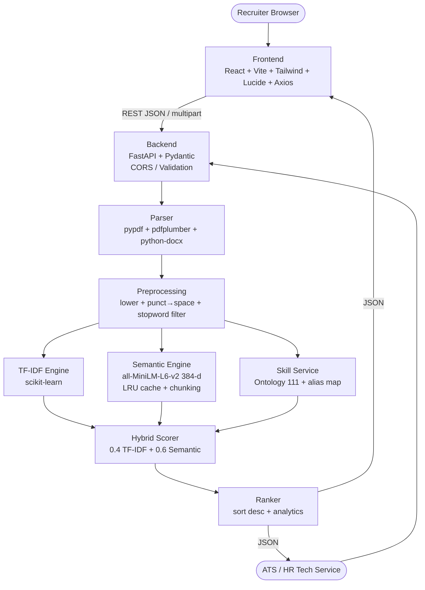

# AI Resume Screening & Job Matching System

> **Hybrid scoring** with **TF-IDF + Cosine** (lexical, 0.4) and **Sentence-Transformers `all-MiniLM-L6-v2` (384-d, 0.6)** plus **skill-ontology gap analysis** — all running locally with <2s p95 latency per resume on CPU.

[](backend/main.py)
[](frontend/src/App.jsx)
[](frontend/tailwind.config.js)
[](backend/services/matching_engine.py)

Docs: **[PRD.md](PRD.md)** • **[ARCHITECTURE.md](ARCHITECTURE.md)** • Live API docs at `http://localhost:8000/docs`

---

## Table of Contents

1. [Problem Statement](#problem-statement)
2. [Core Architecture](#core-architecture)
3. [Tech Stack](#tech-stack)
4. [Monorepo Layout](#monorepo-layout)
5. [Local Setup](#local-setup)
   - [Prerequisites](#prerequisites)
   - [Backend (FastAPI)](#backend-fastapi)
   - [Frontend (React + Vite)](#frontend-react--vite)
   - [Running Both Together](#running-both-together)
6. [Sample API Requests & Response Formats](#sample-api-requests--response-formats)
   - [Health](#get-health)
   - [Upload Resume (PDF/DOCX → text)](#post-apiupload-resume)
   - [Match & Rank](#post-apimatch)
   - [cURL / Python / Axios examples](#examples)
7. [Sample Data](#sample-data)
8. [UI / Screenshots & Mock Description](#ui--screenshots--mock-description)
9. [How It Works (Pipeline)](#how-it-works-pipeline)
10. [Performance & SLOs](#performance--slos)
11. [Troubleshooting](#troubleshooting)
12. [Roadmap](#roadmap)

---

## Problem Statement

Recruiters manually review **200–500 resumes per role** (~75% unqualified) — **15–20 hrs per requisition**. Keyword ATS filters cause **false negatives** (`K8s` ≠ `Kubernetes`, `React` ≠ `Frontend Framework`) and provide **no gap analysis** or explainability.

This system solves it with a **dual-engine, explainable ranker**:

- **Parses** heterogeneous PDF (`pypdf` + `pdfplumber` fallback) and DOCX (`python-docx`) resumes, extracting raw text and candidate name heuristics.
- **Scores** each JD–resume pair twice:
  - **TF-IDF + Cosine** — fast, interpretable lexical overlap (`(1,2)`-grams, 5000 features, `sublinear_tf`, `english` stopwords).
  - **Semantic embeddings** — `sentence-transformers/all-MiniLM-L6-v2` (80 MB, 384-d, 256 tokens max), chunked mean-pool + LRU cache, batched encode.
- **Hybrid**: `total = 0.4*tfidf + 0.6*semantic` (weights normalized if sum≠1, all scores 0–100).
- **Skill extraction** via curated ontology (111 canonical skills, aliases like `k8s→kubernetes`, `ml→machine learning`, `ec2→aws`) using token + 1–3-gram alias resolution, plus gap analysis `job − resume`.
- **Ranks** candidates descending by `total_score` and exposes everything via a clean React dashboard and REST API.

**Outcome:** Screen 50 resumes in **<30s**, ranked with **green matched / red missing skill badges** and progress bars for instant triage. See [PRD.md §1](PRD.md#1-executive-summary--problem-statement) and [ARCHITECTURE.md §1](ARCHITECTURE.md#1-overview--principles) for full product & architecture spec.

---

## Core Architecture

### High-Level Diagram (Mermaid — also in ARCHITECTURE.md §2.1)



ASCII pipeline (ingest → rank) and sequence diagram are documented in [ARCHITECTURE.md §5](ARCHITECTURE.md#5-data-flow-pipeline).

### Data Flow Pipeline

```
Document Ingestion (multipart JD + PDF/DOCX)
        ↓  Parser (pypdf → pdfplumber fallback, python-docx) ~80–200ms
Preprocessing (normalize_text: lower, punct→space, stopword removal) ~10ms
        ↓
   ┌────┼────┐
   TF-IDF  Semantic  Skill Extraction
   20ms   150ms warm  20ms
   └────┼────┘
 Hybrid (weighted 0.4/0.6) → Rank (sort) → JSON
```

**Latency budget** per resume: p50 ~400–700 ms, **p95 ~900–1400 ms** (<2s SLO on 4 vCPU), batch-50 <45s. See [ARCHITECTURE.md §5.3](ARCHITECTURE.md#53-latency-budget-per-resume-prd-slo-2s-p95).

---

## Tech Stack

| Layer | Tech | Notes |
|---|---|---|
| **Backend** | Python 3.10+, **FastAPI 0.110+**, Pydantic v2, Uvicorn, `python-multipart` | ASGI, auto OpenAPI at `/docs` |
| **PDF/DOCX** | `pypdf 4+`, `pdfplumber 0.10+`, `python-docx 1.1+` | Layout-aware fallback when `<50 chars` |
| **ML/NLP** | `scikit-learn 1.3+`, `sentence-transformers 2.2+/6.x`, `torch (CPU)` | TF-IDF `(1,2)`-gram 5000, ST `all-MiniLM-L6-v2` |
| **NLP utils** | `numpy`, `cachetools`, optional `spacy`/`nltk`/`rapidfuzz` | Stopwords via `ENGLISH_STOP_WORDS`, embedding cache 1000 |
| **Frontend** | **React 19 + Vite 8**, **Tailwind CSS 3.4**, **Axios 1.20+**, **lucide-react** | Proxy `/api`→`:8000`, no build-time API URL needed |
| **State/Storage** | In-memory LRU + local JSON/SQLite (extensible per ARCHITECTURE.md §3.4) | Offline-capable, no external calls at inference |
| **Docs** | `PRD.md`, `ARCHITECTURE.md`, OpenAPI `/docs` | Zero-ops self-host |

---

## Monorepo Layout

```
ai_resume_screening/
├── PRD.md
├── ARCHITECTURE.md
├── README.md                ← this file
├── .gitignore               (node_modules, .env, __pycache__, venv, data/)
├── sample_data/             ← sample JDs + resumes for testing (see § Sample Data)
│   ├── job_descriptions/
│   │   ├── backend_engineer_jd.txt
│   │   ├── frontend_engineer_jd.txt
│   │   └── data_scientist_jd.txt
│   └── resumes/
│       ├── alice_chen.txt          # Strong Backend fit
│       ├── bob_kumar.txt           # Low match (design)
│       ├── carol_singh.txt         # Mid Backend fit
│       ├── david_lee.txt           # Frontend specialist
│       └── eve_martin.txt          # ML / DS specialist
├── backend/
│   ├── main.py              # FastAPI app, lifespan, CORS, include router
│   ├── requirements.txt
│   ├── app/__init__.py
│   ├── routers/
│   │   ├── __init__.py
│   │   └── screening.py     # POST /api/upload-resume, POST /api/match
│   ├── services/
│   │   ├── __init__.py
│   │   ├── matching_engine.py  # normalize, TF-IDF, semantic, hybrid
│   │   └── skill_extractor.py  # ontology 111, extract_skills, get_missing_skills
│   └── tests/
│       ├── __init__.py
│       └── test_matching.py    # 40 tests (normalize + TF-IDF + semantic + hybrid)
├── frontend/
│   ├── index.html
│   ├── vite.config.js       # proxy /api + /health → http://localhost:8000
│   ├── tailwind.config.js
│   ├── postcss.config.js
│   ├── package.json
│   └── src/
│       ├── main.jsx
│       ├── index.css        # @tailwind base/components/utilities
│       └── App.jsx          # Header, JD panel, Dropzone, Results Table/Cards
```

Canonical spec layouts are in [ARCHITECTURE.md §4](ARCHITECTURE.md#4-folder-structure-monorepo) (future `app/` modularization planned).

---

## Local Setup

### Prerequisites

- **Python 3.10+** (`python3 --version`) + `pip`
- **Node 18+** (`node -v`, `npm -v`) — Vite 8 requires Node ≥18
- (Optional) `venv` or `conda` for isolation

Model weights `all-MiniLM-L6-v2` (~80 MB) are **downloaded lazily** on first `compute_semantic_score` call (Hugging Face, cached in platform cache). No manual download required. Offline after first run (weights cached).

### Backend (FastAPI)

```bash
# 1. From repo root
python3 -m venv venv
source venv/bin/activate          # Windows: venv\Scripts\activate
pip install --upgrade pip

# 2. Install backend deps (torch CPU extra-index)
pip install -r backend/requirements.txt
# requirements cover: fastapi, uvicorn[standard], pydantic, python-multipart,
#                     pypdf, pdfplumber, python-docx, scikit-learn,
#                     sentence-transformers, torch --index-url https://download.pytorch.org/whl/cpu, etc.

# 3. Run API (port 8000)
uvicorn backend.main:app --reload --port 8000
# or
python -m uvicorn backend.main:app --reload --port 8000
```

Verify:

- `http://localhost:8000` → `{"message":"AI Resume Screening API is running", ...}`
- `http://localhost:8000/health` → `{"status":"ok", "model_loaded":false, ...}` (becomes `true` after first semantic call)
- `http://localhost:8000/docs` → Swagger UI (interactive)
- `http://localhost:8000/openapi.json` → OpenAPI spec

Tests (optional):

```bash
python -m pytest backend/tests/test_matching.py -v
# 40 tests: normalization, TF-IDF, semantic (downloads model once), hybrid, latency p95 <2s
```

### Frontend (React + Vite)

```bash
# 1. From repo root
cd frontend
npm install                     # installs react, vite, tailwind, axios, lucide-react

# 2. Dev server (port 5173, proxying /api → :8000)
npm run dev
# Visit http://localhost:5173

# 3. Production build
npm run build                   # outputs frontend/dist
npm run preview                 # serve dist on :4173
```

Tailwind is configured via `tailwind.config.js` (`content: ["./index.html","./src/**/*.{js,ts,jsx,tsx}"]`) and `src/index.css` (`@tailwind base/components/utilities`). No extra init needed (already committed).

Axios uses **same-origin** (`baseURL: ""`) and relies on Vite `server.proxy` (`/api` and `/health` → `8000`) for dev. For production, serve frontend and backend same-origin or set `VITE_API_BASE`.

### Running Both Together

Terminal 1:

```bash
uvicorn backend.main:app --reload --port 8000
```

Terminal 2:

```bash
cd frontend && npm run dev
```

Open `http://localhost:5173` — Header shows `API Ready`/`Model Ready` badge (health poll). No `.env` required for local dev.

**CORS** is enabled in `backend/main.py` for `http://localhost:5173` + `127.0.0.1:5173` + `*`.

---

## Sample API Requests & Response Formats

Base URL dev: `http://localhost:8000` (via Vite proxy also reachable as `/api/...` from frontend)

### `GET /health`

Liveness + model readiness. Used by Docker HEALTHCHECK and frontend badge.

```bash
curl http://localhost:8000/health
```

**200 Response:**

```json
{
  "status": "ok",
  "model_loaded": false,
  "model_name": "sentence-transformers/all-MiniLM-L6-v2",
  "version": "1.0.0",
  "uptime_seconds": 12.34
}
```

### `POST /api/upload-resume`

Accepts `multipart/form-data` with a single `file` field (PDF or DOCX, max 5MB). Uses `pypdf` → `pdfplumber` fallback for PDFs and `python-docx` for DOCX. Returns raw text + heuristic `candidate_name`.

**cURL:**

```bash
# PDF
curl -X POST http://localhost:8000/api/upload-resume \
  -F "file=@sample_data/resumes/alice_chen.txt" \
  -H "Expect:"

# For PDF/DOCX example:
curl -X POST http://localhost:8000/api/upload-resume \
  -F "file=@/path/to/resume.pdf"
```

**200 Response:**

```json
{
  "filename": "alice_chen.pdf",
  "raw_text": "Alice Chen\nSenior Backend Engineer | Python | AWS\n...",
  "char_count": 812,
  "candidate_name": "Alice Chen",
  "extraction_confidence": 0.81
}
```

**Errors:**

- `400` Invalid file type (only PDF/DOCX)
- `413` File too large (>5MB)
- `422` Extraction failed (<10 chars, e.g., scanned image PDF needing OCR)

> Tip: The dashboard's dropzone calls this endpoint per-file and stores `resume_text` for the subsequent `/match` call. You can also paste text directly (see `/match` accepts JSON).

### `POST /api/match`

Accepts JD + list of parsed candidates (JSON). Computes per PRD §4.2–4.4: TF-IDF, semantic, hybrid (0.4/0.6), plus skill gap. **Sorts `results` by `total_score` descending.**

**Request schema (`backend/routers/screening.py:147`):**

```json
{
  "job_description": "We need a Python developer with AWS, Docker, Kubernetes and machine learning...",
  "candidates": [
    {
      "candidate_name": "Alice Chen",
      "resume_text": "Senior Python developer with AWS, Docker, Kubernetes...",
      "filename": "alice_chen.pdf"
    },
    { "candidate_name": "Bob Kumar", "resume_text": "Graphic designer with Photoshop..." }
  ]
}
```

Aliases also accepted for compatibility: `resumes` (same shape as `candidates`) or `resume_texts: string[]`.

**cURL (JSON):**

```bash
curl -X POST http://localhost:8000/api/match \
  -H "Content-Type: application/json" \
  -d '{
    "job_description": "We need a Python developer with AWS, Docker, Kubernetes and machine learning. Must know FastAPI and PostgreSQL.",
    "candidates": [
      {"candidate_name": "Alice Chen", "resume_text": "Experienced Python developer with AWS, Docker, Kubernetes, FastAPI and PostgreSQL. Built ML pipelines with scikit-learn."},
      {"candidate_name": "Bob Kumar", "resume_text": "Graphic designer with Photoshop, Illustrator, Figma"},
      {"candidate_name": "Carol Singh", "resume_text": "Python developer with AWS and Docker but no Kubernetes or ML."}
    ]
  }' | python -m json.tool
```

**Python (requests):**

```python
import requests
jd = open("sample_data/job_descriptions/backend_engineer_jd.txt").read()
resumes = [
    {"candidate_name": "Alice", "resume_text": open("sample_data/resumes/alice_chen.txt").read()},
    {"candidate_name": "Bob", "resume_text": open("sample_data/resumes/bob_kumar.txt").read()},
]
r = requests.post("http://localhost:8000/api/match", json={"job_description": jd, "candidates": resumes})
print(r.json())
```

**Axios (frontend shape — `frontend/src/App.jsx:195`):**

```js
import axios from "axios";
const { data } = await axios.post("/api/match", {
  job_description: jd,
  candidates: parsedFiles.map(p => ({ candidate_name: p.candidate_name, resume_text: p.resume_text, filename: p.filename })),
});
```

**200 Response (shape `backend/routers/screening.py:129`):**

```json
{
  "job_description_preview": "We need a Python developer with AWS, Docker, Kubernetes and machine learning experience. Must know FastAPI and PostgreSQL...",
  "total_candidates": 3,
  "results": [
    {
      "candidate_name": "Alice Chen",
      "total_score": 64.22,
      "tfidf_score": 38.10,
      "semantic_score": 81.66,
      "matching_skills": ["aws", "docker", "fastapi", "kubernetes", "machine learning", "postgresql", "python"],
      "missing_skills": [],
      "extra_skills": ["scikit-learn"]
    },
    {
      "candidate_name": "Carol Singh",
      "total_score": 61.84,
      "tfidf_score": 40.12,
      "semantic_score": 76.31,
      "matching_skills": ["aws", "docker", "kubernetes", "python"],
      "missing_skills": ["fastapi", "machine learning", "postgresql"],
      "extra_skills": ["spark"]
    },
    {
      "candidate_name": "Bob Kumar",
      "total_score": 8.14,
      "tfidf_score": 0.0,
      "semantic_score": 13.56,
      "matching_skills": [],
      "missing_skills": ["aws", "docker", "fastapi", "kubernetes", "machine learning", "postgresql", "python"],
      "extra_skills": ["figma"]
    }
  ]
}
```

**Fields:**

| Field | Type | Notes |
|---|---|---|
| `candidate_name` | string | From upload heuristic or `candidate_name` input; fallback `Candidate N` |
| `total_score` | float 0–100 | Hybrid `0.4*tfidf + 0.6*semantic` |
| `tfidf_score` | float 0–100 | `TfidfVectorizer(1-2gram, 5000, sublinear_tf, english)` + cosine |
| `semantic_score` | float 0–100 | `all-MiniLM-L6-v2` cosine, L2-normalized, clipped 0–1 |
| `matching_skills` | string[] | `resume ∩ job` (canonical, alias-resolved) — rendered **green badges** |
| `missing_skills` | string[] | `job − resume` — rendered **red badges** |
| `extra_skills` | string[] | `resume − job` strengths beyond JD |

**Errors:**

- `422` empty/too-short JD (min 10 chars) or Pydantic validation
- `400` no candidates supplied
- `413` >100 candidates
- `500/503` model failure or not ready (fallback to TF-IDF with `X-Fallback: tfidf-only` header per ARCHITECTURE.md §10)

**OpenAPI:** Full interactive docs at `http://localhost:8000/docs` (Swagger).

### Examples

<details><summary><b>End-to-end test with sample_data (bash)</b></summary>

```bash
# 1. Start backend: uvicorn backend.main:app --reload --port 8000

# 2. Health
curl http://localhost:8000/health

# 3. Upload sample resume (DOCX or PDF) — if you have a PDF/DOCX, text .txt will be rejected by mime check;
#    instead paste text directly via /match (JSON). For demo, use text files with API.
JD=$(cat sample_data/job_descriptions/backend_engineer_jd.txt)

# 4. Match using sample resumes (text files, via JSON)
python3 - << 'PY'
import requests, pathlib, json
jd = pathlib.Path("sample_data/job_descriptions/backend_engineer_jd.txt").read_text()
resumes_dir = pathlib.Path("sample_data/resumes")
candidates = []
for p in sorted(resumes_dir.glob("*.txt")):
    candidates.append({"candidate_name": p.stem.replace("_"," ").title(), "resume_text": p.read_text()})
r = requests.post("http://localhost:8000/api/match", json={"job_description": jd, "candidates": candidates})
print(f"Status: {r.status_code}")
for c in r.json()["results"]:
    print(f"{c['candidate_name']:15} total={c['total_score']:5.1f} tfidf={c['tfidf_score']:4.1f} semantic={c['semantic_score']:4.1f} matched={c['matching_skills']} missing={c['missing_skills']}")
PY
```

Expected ranking for `backend_engineer_jd` (approx, depends on warm cache):

- **Alice Chen** strong fit (Python, AWS, Docker, K8s, FastAPI, PostgreSQL, ML) — highest total/semantic
- **Carol Singh** moderate (Python, AWS, Docker, K8s, partial ML)
- **Eve Martin** ML-heavy but missing AWS/K8s/FastAPI
- **David Lee** frontend — low on backend JD
- **Bob Kumar** near-zero (design)

Try **frontend JD** to see David rank first, and **data scientist JD** to see Eve rank first.

</details>

---

## Sample Data

Located in [`sample_data/`](sample_data):

```
sample_data/
├── job_descriptions/
│   ├── backend_engineer_jd.txt   # Senior Backend — Python/FastAPI/AWS/Docker/K8s/PostgreSQL/ML
│   ├── frontend_engineer_jd.txt  # Frontend — React/Next.js/TypeScript/Tailwind/Figma
│   └── data_scientist_jd.txt     # Data Scientist — ML/DL/NLP/scikit-learn/PyTorch/HF
└── resumes/
    ├── alice_chen.txt   # Senior Backend (all Backend JD skills) — expect 80%+
    ├── bob_kumar.txt    # Graphic Designer (unrelated) — expect <15%
    ├── carol_singh.txt  # Python + AWS/Docker/K8s/Spark — expect ~60%
    ├── david_lee.txt    # Frontend specialist (React/Next.js/Tailwind/Jest) — high on Frontend JD
    └── eve_martin.txt   # Data Scientist (ML/DL/NLP/PyTorch) — high on DS JD
```

All resumes are plain text (already extracted) for quick **JSON matching tests** without needing PDF/DOCX upload. For **PDF/DOCX parsing tests**, drag real PDF/DOCX files in the dashboard's dropzone (handled by `POST /api/upload-resume` using `pypdf`/`pdfplumber`/`python-docx`).

The dashboard also has a **Load demo** button that injects 3 in-memory demo candidates for instant triage.

---

## UI / Screenshots & Mock Description

The frontend is a single-page React dashboard (`frontend/src/App.jsx:1`) with Tailwind styling and `lucide-react` icons, proxying to FastAPI.

### Layout (Desktop) — ASCII wireframe

```
+---------------------------------------------------------------------------------+
| Header: [Brain] AI Resume Screening & Job Matching | API Docs | ● Model Ready   |
+---------------------------------------------------------------------------------+
| +-------------------------------+  +------------------------------------------+ |
| | Job Description  812 chars    |  | Resume Upload  PDF/DOCX • 5MB            | |
| | +---------------------------+ |  | +-------------------- Drag & Drop ------+ | |
| | | We need a Python dev...   | |  | |  [Upload] Drop resumes here or click | | |
| | | with AWS, Docker, K8s...  | |  | +--------------------------------------+ | |
| | +---------------------------+ |  | | ✓ Alice Chen  alice.pdf • 812 chars    | | |
| |   tip / Clear               | |  | | ◌ Bob Kumar   bob.docx • 420 chars     | | |
| +-------------------------------+  |  | 1 of 2 parsed • Clear all              | |
+---------------------------------------------------------------------------------+
| [BarChart] 2 candidates ready • Hybrid 0.4 TF-IDF + 0.6 Semantic | Reset | [Match & Rank (2)] |
+---------------------------------------------------------------------------------+
| [Error banner if any: AlertTriangle]                                            |
+---------------------------------------------------------------------------------+
| Ranking Results (2 candidates)  Sorted by Total Score descending                |
| + Top 64.2% | Avg 36.2% | Best Alice Chen | Gap Focus FastAPI                  |
| +--------------------------------------------------------------------------------+
| | # | Candidate   | Match % (Progress)    | Details         | Matched (green) | Missing (red) |
| | 1 | Alice Chen  | 64.2% [██████▏    ]    | TF-IDF 38.1% [█▋      ] | python aws | fastapi     |
| |   |             | Strong Fit            | Semantic 81.6%[████████▎] | docker k8s | postgresql   |
| | 2 | Bob Kumar   | 8.1%  [▎         ]    | TF-IDF 0.0%  | figma         | python aws... |
| +--------------------------------------------------------------------------------+
| (Mobile: Cards with same data, stacked, 1 per row)                               |
| Legend: ● Matched (green) ● Missing (red)  Total = 0.4 TF-IDF + 0.6 Semantic   |
+---------------------------------------------------------------------------------+
| No rankings yet  [BarChart]  “Upload resumes and enter a JD to see hybrid…”  |  |
+---------------------------------------------------------------------------------+
| Footer: Built with React (Vite) + Tailwind • FastAPI + sklearn + all-MiniLM    |
+---------------------------------------------------------------------------------+
```

**Rendered description (when populated):**

- **Header:** Left: indigo `Brain` icon + title. Right: `API Docs` link (to `/docs`) + status pill (`Model Ready` emerald / `API Ready` amber). Sticky with backdrop blur.
- **Job Description Panel:** Textarea with `813` chars indicator, muted placeholder, `Clear` link. Soft gray background, focus ring indigo.
- **Upload Dropzone:** Dashed border, upload icon, `Drop resumes here or click to browse` centered. On drag: indigo highlight. Multi-file; each file row shows status icon (`Loader2` spinning → `CheckCircle2` green or `XCircle` red), `candidate_name` (`_infer_candidate_name` from `screening.py:85`), `char_count`, trash button. Shows `X of Y parsed` and `Clear all`.
- **Action Bar:** Left summary `2 candidates ready • Hybrid 0.4 TF-IDF + 0.6 Semantic` with `BarChart3`. Right `Reset` (white) and `Match & Rank (2)` (indigo, `Search` icon, loading spinner).
- **Results Table (desktop `lg:block`):** Header `Trophy` + count + JD preview suffix. Analytics 4-card grid (Top/Avg/Best/Gap). Table columns: `#` (amber-100 for rank 1), `Candidate` (name + `TF-IDF x.x • Semantic y.y`), `Match %` (bold `64.2%` + `Strong Fit/Moderate/Low` + `ProgressBar`), `Details` (two mini bars), `Matched` (emerald badges), `Missing` (red badges or `CheckCircle2 None`). Hover row muted.
- **Cards (mobile):** One card per candidate with rank circle, name, total %, main progress bar, matched/missing sections.
- **Empty State:** Dashed rounded box, `BarChart3` indigo tint, `No rankings yet` + API hint `POST /api/upload-resume + POST /api/match via Axios`.
- **A11y/Polish:** Keyboard focus rings, disabled buttons at 60% opacity, 300ms transitions, responsive grid.

**To capture a real screenshot locally:**

1. Start backend + frontend (see Local Setup).
2. Upload `sample_data/resumes/*.txt` content as PDFs/DOCXs or click **Load demo**.
3. Use `backend_engineer_jd.txt` as JD, click **Match & Rank**.

Browser screenshot shortcut: `Cmd+Shift+4` (macOS) or `PrtScn`/`Win+Shift+S` (Windows), then save to `docs/` and reference in PR.

> **Mock screenshots commit:** If you prefer tracked images, add them under `frontend/public/` or `docs/screenshots/` and reference `` here. The app's seeded demo data ensures deterministic visuals.

---

## How It Works (Pipeline)

Detailed in [ARCHITECTURE.md §5](ARCHITECTURE.md#5-data-flow-pipeline); summarized:

1. **Ingest** — `POST /api/upload-resume` validates MIME+extension and 5MB, dispatch `pypdf` → `pdfplumber` fallback for scanned/layout PDFs, or `python-docx` for DOCX (paragraphs + tables).
2. **Preprocessing** — `matching_engine.normalize_text` lowercases, `punct→space` preserving `CI/CD`, `ENGLISH_STOP_WORDS` + length≥2 filter, whitespace collapse. Skill extraction tokenizes with `_TOKEN_RE` keeping `c++`, `c#`, `.net`.
3. **Hybrid Scoring** — `compute_tfidf_score` per-request `TfidfVectorizer` fit on JD+resume (or batch fit) → cosine 0–100; `compute_semantic_score` via cached `all-MiniLM-L6-v2` embeddings (chunked mean-pool, LRU 1000) → cosine 0–100; `compute_hybrid_score` weighted 0.4/0.6 (auto-normalized).
4. **Skill Gap** — `extract_skills` matches 1–3-grams against 111-canonical ontology with alias map; `get_missing_skills(job, resume)`, `get_matched_skills`, `get_extra_skills`, `skill_gap_analysis` set operations.
5. **Rank** — `screening.py:332` sorts `CandidateResult` list descending by `total_score`; returns `job_description_preview` + `total_candidates` + `results`.
6. **Frontend** — Vite proxies `/api` to `8000`, dropzone uploads → `raw_text` cache, match button triggers `POST /api/match`, renders `ProgressBar:28` and `Badge:46`.

---

## Performance & SLOs

Per PRD §7 / ARCHITECTURE.md §5.3:

| Stage | Budget | Notes |
|---|---|---|
| Parse (PDF/DOCX) | 80–200 ms | `pypdf` fast; `pdfplumber` adds ~100 ms |
| Preprocess | 10–30 ms | Regex + stopword filter |
| TF-IDF | 20–50 ms | Per-request fit (2-doc or batch 1-fit) |
| Semantic (warm) | 150–300 ms | `all-MiniLM-L6-v2` batched 32, cache hit ~5 ms |
| Skill extract | 20–60 ms | Dictionary + ruler 111 entries |
| Hybrid + Rank | <5 ms | Arithmetic + sort |
| **Total p50** | **~400–700 ms** | |
| **Total p95** | **~900–1400 ms** | **Meets <2s SLO** |
| **Batch-50** | **<45 s** total | End-to-end |

Benchmark script (future): `pytest backend/tests/benchmark_latency.py` asserts `elapsed < 2.0` for warm single match (`test_matching.py:342`).

---

## Troubleshooting

| Symptom | Fix |
|---|---|
| `ModuleNotFoundError: No module named 'sklearn'` / `sentence_transformers` | `pip install -r backend/requirements.txt` (with `venv` activated) or `pip install --break-system-packages ...` on PEP 668 systems |
| `403/externally-managed-environment` on `pip install` | Use `venv` or add `--break-system-packages` |
| `pdfplumber` / `pypdf` extraction empty (`422`) | File is scanned image PDF (no OCR V1); try DOCX or select text PDF |
| Frontend shows `CORS error` | Ensure backend on `:8000` and `frontend/vite.config.js` proxy includes `'/api'` + `'/health'` |
| Model download slow / `Warning: unauthenticated HF Hub` | Set `HF_TOKEN` env var or wait for ~80 MB cache; subsequent loads are offline |
| `npm run dev` fails on old Node | Upgrade to Node 18+ (`node -v`) |
| `axios 401/422` on `/api/match` | JD must be ≥10 chars; supply `candidates` or `resumes` or `resume_texts` with ≥1 `resume_text` |
| Build `No utility classes were detected` (Tailwind warn) | Tailwind `content` already set; ignore if `npm run build` still emits 16KB CSS |

---

## Roadmap

- **M0 Foundation** (Done): scaffold `/backend` + `/frontend`, requirements, health.
- **M1 Semantic Core** (Done): `matching_engine.py` (TF-IDF + MiniLM hybrid 0.4/0.6), `test_matching.py` 40 tests.
- **M2 Skills** (Done): `skill_extractor.py` (111 ontology, alias-aware n-grams, gap detection).
- **M3 API + UI** (Done): `routers/screening.py` (`/upload-resume`, `/match`, CORS), `App.jsx` dashboard.
- **M4 Hardening** (Next): Docker bake of MiniLM weights, `benchmark_latency.py` strict p95, SQLite/JSON persistence, CSV export, `GET /taxonomy`.
- **V1.1** (Future): OCR (Tesseract), multilingual, `PyMuPDF` fast path, LLM re-ranker, PostgreSQL, auth `X-API-Key`, fairness metrics.

---

## License

MIT (planned). Contributions welcome via PR to `main`. Please run `pytest` and `npm run build` before submitting.

---

**Maintained by:** Glitch-19 • **Model:** `sentence-transformers/all-MiniLM-L6-v2` • **Docs:** `PRD.md`, `ARCHITECTURE.md` • **API:** `http://localhost:8000/docs`

